# LK Bus Radar — Enterprise System Architecture Documentation

> **Document Type:** System Architecture & Technical Reference
> **Audience:** Senior Engineers, System Architects, Onboarding Developers
> **Standard:** C4 Model +  API docs + ER Diagrams
> **Last Updated:** March 2026

---

## Table of Contents

1. [System Overview](#1-system-overview)
2. [C4 Architecture Model](#2-c4-architecture-model)
3. [Project Folder Structure](#3-project-folder-structure)
4. [Backend Architecture](#4-backend-architecture)
5. [API Documentation](#5-api-documentation)
6. [Database Architecture](#6-database-architecture)
7. [Data Flow Analysis](#7-data-flow-analysis)
8. [Frontend Architecture](#8-frontend-architecture)
9. [Component Documentation](#9-component-documentation)
10. [Service Dependency Graph](#10-service-dependency-graph)
11. [API Dependency Graph](#11-api-dependency-graph)
12. [Event & Communication Architecture](#12-event--communication-architecture)
13. [Security Architecture](#13-security-architecture)
14. [Performance Considerations](#14-performance-considerations)
15. [Deployment Architecture](#15-deployment-architecture)
16. [Observability](#16-observability)
17. [Scalability Strategy](#17-scalability-strategy)
18. [Future Improvements](#18-future-improvements)

---

## 1. System Overview

### Executive Summary

**LK Bus Radar** is a full-stack, real-time public transport tracking and ticketing platform built for Sri Lanka's Southern Province bus network. It enables commuters to track live bus positions on an interactive map, browse timetables, pre-book seats, and pay fares electronically using a points wallet — all from a mobile-first progressive web application.

The system ingests GPS telemetry and schedule data from an external government transport API (SPGPS), normalises it into a structured MongoDB database, and serves it to the frontend via a purpose-built REST API. Fleet administrators manage the entire data lifecycle through a dedicated admin portal.

### Core Functionality

| Capability                    | Description                                                                                  |
| ----------------------------- | -------------------------------------------------------------------------------------------- |
| **Live Bus Tracking**         | Real-time GPS positions of all buses, updated every 15 seconds on an interactive Leaflet map |
| **Route & Timetable Browser** | Full route directory with stop sequences, inter-stop distances, and departure timetables     |
| **Seat Booking**              | Pre-book seats on specific scheduled trips with capacity enforcement                         |
| **Electronic Fare Payment**   | Points-based wallet system; 1 LKR = 1 point, fare deducted on alighting via QR scan          |
| **Journey Tracking**          | Live trip view showing bus position, stops remaining, speed, distance, and alighting scan    |
| **Fleet Administration**      | Full CRUD for routes, buses, stops, timetables, owners, and permits via admin portal         |
| **Automated Sync**            | Hourly ingestion of static transport data; 15-second live position sync from SPGPS API       |
| **Sync Conflict Resolution**  | Admin-modified fields are protected; incoming conflicts are queued for human review          |

### Key Modules

```
┌─────────────────────────────────────────────────────────────────────────┐
│                         LK Bus Radar System                             │
├───────────────────┬──────────────────────────┬────────────────────────┤
│  Tracking Engine  │    Booking & Payments     │  Fleet Management      │
│  ─────────────── │  ────────────────────────│  ─────────────────────│
│  GPS Sync (15s)  │  Seat Reservation         │  Route/Stop Editor     │
│  Map Rendering   │  Points Wallet            │  Timetable Builder     │
│  Journey Tracking│  QR Fare Collection       │  Sync Review           │
│  Direction Logic │  Transaction Ledger       │  Admin Dashboard       │
└───────────────────┴──────────────────────────┴────────────────────────┘
```

### Primary Technologies

| Layer               | Technology              | Version       | Purpose                |
| ------------------- | ----------------------- | ------------- | ---------------------- |
| Frontend Framework  | Next.js (App Router)    | 16.1.6        | SSR + client routing   |
| UI Library          | React                   | 19.2.4        | Component rendering    |
| Styling             | Tailwind CSS            | 4.2.0         | Utility-first CSS      |
| Map Engine          | Leaflet / react-leaflet | 1.9.4 / 5.0.0 | Interactive mapping    |
| Data Fetching       | SWR                     | 2.2.5         | Caching + polling      |
| Authentication      | Firebase Auth           | 12.10.0       | Email/password auth    |
| Animation           | Framer Motion           | 12.35.2       | UI transitions         |
| Charts              | Recharts                | 2.15.0        | Admin dashboard        |
| Backend Framework   | Express                 | 5.1.0         | REST API server        |
| Database            | MongoDB / Mongoose      | 8.10.0        | Document storage + ODM |
| Job Scheduling      | node-cron               | 4.0.5         | Background sync jobs   |
| Auth Verification   | Firebase Admin SDK      | —             | Token verification     |
| External API Client | Axios                   | 1.8.2         | SPGPS data ingestion   |
| Language            | TypeScript              | 5.7–5.8       | Full-stack typing      |

---

## 2. C4 Architecture Model

### Level 1 — System Context Diagram

This diagram shows how the LK Bus Radar system interacts with external actors and services.

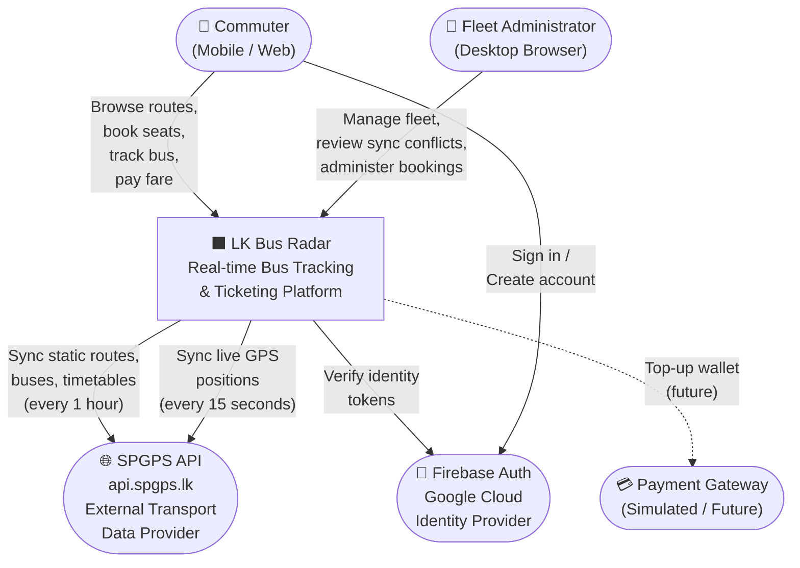

**Actor Descriptions:**

- **Commuter** — The primary end-user accessing the system through a mobile or desktop browser. Interacts with the map, booking flow, and QR code scanner.
- **Fleet Administrator** — Internal staff with elevated `admin` role. Manages routes, buses, stops, timetables, and reviews data conflicts.
- **SPGPS API** — Sri Lanka Province GPS System. The authoritative upstream data source for all route, bus, device, and live position data.
- **Firebase Auth** — Google-managed identity provider. Handles user registration, sign-in, and issues signed JWT tokens that the backend verifies.
- **Payment Gateway** — Currently simulated in the system. Payment intent is modelled but card processing is mocked.

---

### Level 2 — Container Diagram

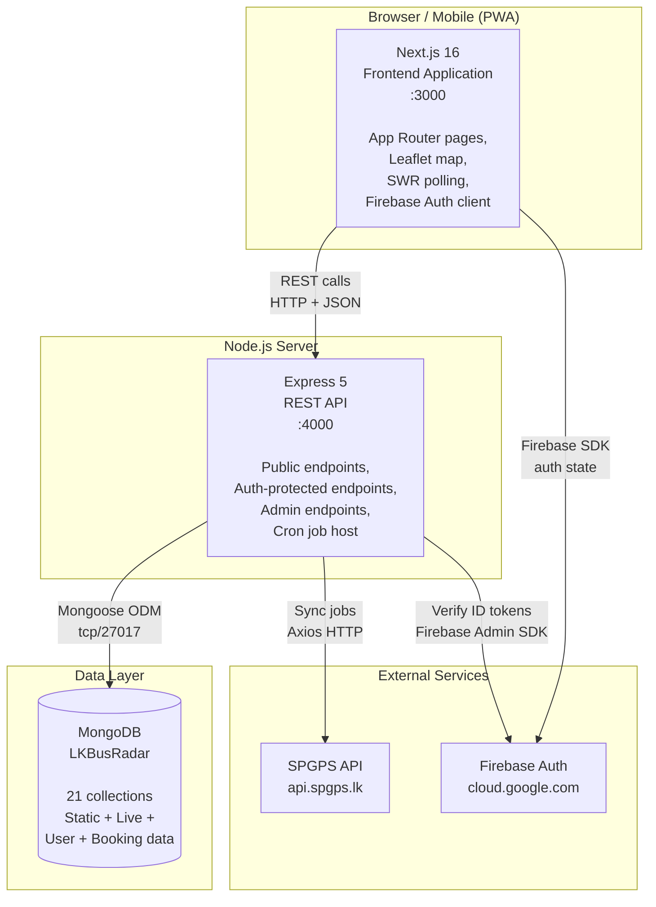

**Container Responsibilities:**

| Container            | Technology           | Responsibilities                                                                                              |
| -------------------- | -------------------- | ------------------------------------------------------------------------------------------------------------- |
| **Next.js Frontend** | Next.js 16, React 19 | All UI rendering, client-side routing, SWR-based data polling, Leaflet map, QR scanning, Firebase client auth |
| **Express REST API** | Express 5, Node.js   | Business logic, authentication middleware, all DB operations, SPGPS sync orchestration, cron scheduling       |
| **MongoDB**          | MongoDB 7 + Mongoose | Persistent storage for all 21 collections, indexing, atomic upserts                                           |
| **Firebase Auth**    | Google Cloud         | User identity, JWT token issuance, token verification via Admin SDK                                           |
| **SPGPS API**        | External             | Source of truth for routes, buses, stops, timetables, live GPS positions                                      |

---

### Level 3 — Component Diagram

#### Backend Component Breakdown

```mermaid
graph TD
    ExpressServer["Express Server\nserver.ts"]

    subgraph Middleware
        AuthMW["authMiddleware\nrequireAuth / requireAdmin\nFirebase token verify + DB role check"]
        CORS["CORS Middleware\ncors()"]
        JSON["JSON Body Parser\nexpress.json()"]
    end

    subgraph Controllers
        PublicCtrl["publicController\nPublic data endpoints\n(routes, devices, timetable,\nbus stands, passengers)"]
        BookingCtrl["bookingController\nSeat reservation,\npayment, cancellation"]
        JourneyCtrl["journeyController\nBoard, alight,\nactive/history endpoints"]
        UserCtrl["userController\nProfile CRUD,\npoints & wallet"]
        AdminCtrl["adminFleetController\nAll fleet CRUD\n+ journey admin + stats"]
        SyncCtrl["syncController\nManual sync triggers"]
        SyncReviewCtrl["syncReviewController\nConflict review CRUD"]
    end

    subgraph Services
        LiveSvc["liveLocationService\nFetch + upsert\nlive positions"]
        StaticSvc["syncStaticTransportService\nOrchestrate full\nstatic data sync"]
        RoutesSvc["syncRoutesService\nSync Route collection"]
        MetaSvc["syncRouteMetaService\nSync BusStop + RouteStop"]
        TimetableSvc["syncTimetableService\nSync slots + times"]
        DeviceSvc["syncDevicesService\nSync Device + Bus"]
        AutoJourney["autoCompleteJourneys\nAuto-complete active\njourneys at last stop"]
        AutoBooking["autoCompleteBookings\nAuto-expire draft\nbookings"]
    end

    subgraph Utils
        JourneyUtils["journeyUtils\nHaversine, bearing,\ndirection detection,\nfare lookup"]
        ApiClient["apiClient\nAxios + retry\nfor SPGPS calls"]
        FirebaseAdmin["firebaseAdmin\nFirebase Admin\nSDK init"]
        DiffChecker["diffChecker\nDetect field\nconflicts on sync"]
    end

    subgraph CronJobs
        Cron["cronJobs.ts\nnode-cron scheduler\nEvery 15s: live\nEvery 1hr: static\nEvery 1min: auto-complete"]
    end

    ExpressServer --> CORS
    ExpressServer --> JSON
    ExpressServer --> PublicCtrl
    ExpressServer --> AuthMW
    AuthMW --> BookingCtrl
    AuthMW --> JourneyCtrl
    AuthMW --> UserCtrl
    AuthMW --> AdminCtrl
    AuthMW --> SyncCtrl
    AuthMW --> SyncReviewCtrl

    BookingCtrl --> JourneyUtils
    JourneyCtrl --> JourneyUtils
    AdminCtrl --> JourneyUtils

    Cron --> LiveSvc
    Cron --> StaticSvc
    Cron --> AutoJourney
    Cron --> AutoBooking

    StaticSvc --> RoutesSvc
    StaticSvc --> MetaSvc
    StaticSvc --> TimetableSvc
    StaticSvc --> DeviceSvc

    LiveSvc --> ApiClient
    RoutesSvc --> ApiClient
    MetaSvc --> ApiClient
    TimetableSvc --> ApiClient
    DeviceSvc --> ApiClient

    MetaSvc --> DiffChecker
    StaticSvc --> DiffChecker

    AuthMW --> FirebaseAdmin
```

---

## 3. Project Folder Structure

```
LK_BUS_RADAR/
│
├── project/                          # Monorepo root
│   │
│   ├── app/                          # Next.js App Router pages
│   │   ├── layout.tsx                # Root layout — AppShell, fonts, providers
│   │   ├── page.tsx                  # Home page — live map + bus list
│   │   ├── booking/
│   │   │   └── page.tsx              # Seat booking wizard
│   │   ├── mybookings/
│   │   │   └── page.tsx              # User booking history
│   │   ├── wallet/
│   │   │   └── page.tsx              # Points wallet + transaction history
│   │   ├── journeys/
│   │   │   └── page.tsx              # Journey history list
│   │   ├── journey/[journeyId]/
│   │   │   ├── page.tsx              # Live journey view (map + side panel)
│   │   │   └── JourneyMap.tsx        # Leaflet map component (lazy loaded)
│   │   ├── payment/[bookingId]/
│   │   │   └── page.tsx              # Payment simulation screen
│   │   ├── routes/
│   │   │   └── page.tsx              # Public route browser
│   │   ├── timetable/
│   │   │   └── page.tsx              # Route timetable viewer
│   │   ├── busStands/
│   │   │   └── page.tsx              # Bus stand contact directory
│   │   ├── profile/
│   │   │   └── page.tsx              # User profile editor
│   │   ├── scan/
│   │   │   └── page.tsx              # Standalone QR scanner
│   │   └── admin/
│   │       ├── layout.tsx            # Admin layout — sidebar navigation
│   │       ├── page.tsx              # Dashboard — stats + charts
│   │       ├── routes/
│   │       │   ├── page.tsx          # Route CRUD + stop map editor
│   │       │   └── StopsMapEditor.tsx# Leaflet stop placement tool
│   │       ├── buses/page.tsx
│   │       ├── owners/page.tsx
│   │       ├── permits/page.tsx
│   │       ├── busStops/page.tsx
│   │       ├── timetables/page.tsx
│   │       ├── bookings/page.tsx
│   │       ├── users/page.tsx
│   │       ├── busStands/page.tsx
│   │       ├── configs/page.tsx      # System config editor
│   │       ├── journeys/page.tsx     # Journey analytics + admin controls
│   │       ├── qrcodes/page.tsx      # QR code generator for buses
│   │       └── sync-review/page.tsx  # Sync conflict resolution UI
│   │
│   ├── components/
│   │   ├── layout/
│   │   │   └── AppShell.tsx          # Main shell — nav, sidebar, auth gate
│   │   ├── map/
│   │   │   ├── BusMap.tsx            # Primary Leaflet map container
│   │   │   ├── BusMarker.tsx         # Individual bus marker with popup
│   │   │   ├── RoutePolyline.tsx     # Route overlay (polyline + stop circles)
│   │   │   └── RouteFitter.tsx       # Auto-fit map bounds to route
│   │   ├── panels/
│   │   │   ├── BusDetailsPanel.tsx   # Slide-out panel for selected bus
│   │   │   ├── RouteDetailsPanel.tsx # Route detail — stops, timetable, live buses
│   │   │   ├── TimetableInnerPanel.tsx
│   │   │   └── RouteTimetableContent.tsx
│   │   └── ui/                       # Shadcn UI base components + custom overrides
│   │       ├── button.tsx, input.tsx, badge.tsx, dialog.tsx ...
│   │       ├── AuthModal.tsx         # Firebase sign-in/register modal
│   │       └── SearchBar.tsx         # Global route search component
│   │
│   ├── hooks/
│   │   ├── useTransportData.ts       # SWR polling for routes + live devices
│   │   ├── useAuth.ts                # Firebase auth state listener
│   │   ├── useAdminAuth.ts           # Admin auth with role enforcement
│   │   ├── use-mobile.ts             # Responsive breakpoint detection
│   │   └── use-toast.ts              # Toast notification hook
│   │
│   ├── services/
│   │   └── transportApi.ts           # All API endpoint constants + TypeScript types
│   │
│   ├── data/
│   │   ├── transportBuilder.ts       # Enriches raw device data with route info
│   │   └── lookupMaps.ts             # Builds lookup maps from routes/devices arrays
│   │
│   ├── lib/
│   │   ├── firebase.ts               # Firebase client SDK initialisation
│   │   ├── notify.ts                 # Toast notification wrappers
│   │   └── utils.ts                  # cn() classname utility
│   │
│   ├── public/                       # Static assets (icons, images)
│   ├── .env                          # Frontend environment config
│   ├── next.config.ts                # Next.js config
│   ├── tailwind.config.ts            # Tailwind config
│   ├── tsconfig.json
│   └── package.json
│
└── project/server/                   # Express backend
    ├── server.ts                     # Express app bootstrap + route mounting
    │
    ├── models/                       # Mongoose schemas (21 collections)
    │   ├── Route.ts                  # Route metadata
    │   ├── Bus.ts                    # Vehicle (bus)
    │   ├── BusStop.ts                # Geographic stop
    │   ├── RouteStop.ts              # Stop ↔ Route mapping with order
    │   ├── RunningNumber.ts          # Bus series identifier
    │   ├── RunningSlot.ts            # Scheduled trip slot
    │   ├── RunningSlotStop.ts        # Timetable (stop × time)
    │   ├── BusTurn.ts                # Driver turn session
    │   ├── Device.ts                 # GPS device
    │   ├── RoutePermit.ts            # Operating permit
    │   ├── Owner.ts                  # Bus owner
    │   ├── LiveVehicle.ts            # Real-time GPS position
    │   ├── LiveRouteVehicle.ts       # Denormalized live view per route
    │   ├── User.ts                   # User profile + wallet
    │   ├── Booking.ts                # Seat booking
    │   ├── Journey.ts                # Trip journey (board → alight)
    │   ├── PointTransaction.ts       # Wallet transaction log
    │   ├── FareSection.ts            # Fare table (stops → points)
    │   ├── Config.ts                 # System configuration
    │   ├── BusStandContact.ts        # Bus stand phone directory
    │   └── SyncReview.ts             # Data conflict records
    │
    ├── controllers/
    │   ├── publicController.ts
    │   ├── bookingController.ts
    │   ├── journeyController.ts
    │   ├── userController.ts
    │   ├── adminFleetController.ts
    │   ├── syncController.ts
    │   └── syncReviewController.ts
    │
    ├── middleware/
    │   └── authMiddleware.ts
    │
    ├── services/
    │   ├── liveLocationService.ts
    │   ├── syncStaticTransportService.ts
    │   ├── syncRoutesService.ts
    │   ├── syncRouteMetaService.ts
    │   ├── syncTimetableService.ts
    │   ├── syncDevicesService.ts
    │   ├── autoCompleteJourneys.ts
    │   └── autoCompleteBookings.ts
    │
    ├── jobs/
    │   └── cronJobs.ts
    │
    ├── utils/
    │   ├── firebaseAdmin.ts
    │   ├── apiClient.ts
    │   ├── journeyUtils.ts
    │   ├── diffChecker.ts
    │   └── adminSyncFields.ts
    │
    ├── config/
    │   ├── db.ts                     # MongoDB connection (mongoose.connect)
    │   └── env.ts                    # Typed environment variables
    │
    ├── Resources/
    │   └── apiEndpoints.json         # SPGPS API URL registry
    │
    ├── .env                          # Backend environment config
    ├── tsconfig.json
    └── package.json
```

---

## 4. Backend Architecture

### Framework & Design Principles

The backend is a single-process **Express 5** application written in TypeScript, running on Node.js. It follows a **layered architecture** with clear separation between routing, controller, service, and data access layers. All TypeScript files use `ts-node` for execution.

**Design decisions:**

- **No ORM abstraction beyond Mongoose** — Mongoose schemas serve as both schema validation and data access layer. Business logic lives in controllers and service files.
- **Synchronous-style controllers with async/await** — All controllers are async functions attached directly to Express router instances. Express 5's native async error propagation is used.
- **Inline model imports** — Some controllers use `require()` inline for circular-dependency-safe access to models at call time (valid in Node.js CommonJS runtime).
- **Stateless API** — All authentication state comes from the verified Firebase JWT; no server-side sessions.

### Request Lifecycle

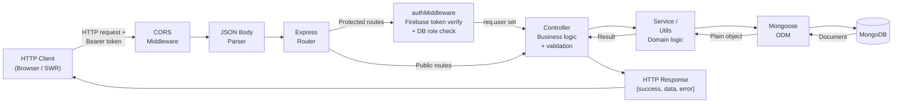

### Middleware Stack

| Middleware       | Scope            | Purpose                                           |
| ---------------- | ---------------- | ------------------------------------------------- |
| `cors()`         | Global           | Allows cross-origin requests from frontend        |
| `express.json()` | Global           | Parses JSON request bodies                        |
| `requireAuth`    | Protected routes | Verifies Firebase JWT, upserts user in DB         |
| `requireAdmin`   | Admin routes     | Extends `requireAuth` + checks `role === 'admin'` |

### Controller Responsibilities

| Controller             | Route Prefix         | Primary Responsibility                                                                 |
| ---------------------- | -------------------- | -------------------------------------------------------------------------------------- |
| `publicController`     | `/api/public`        | Serves all publicly accessible transport data (routes, devices, timetable, bus stands) |
| `bookingController`    | `/api/booking`       | Manages seat booking lifecycle: create draft, pay, cancel                              |
| `journeyController`    | `/api/journey`       | Handles trip tracking: board (QR scan), alight (QR scan), active journey, history      |
| `userController`       | `/api/user`          | User profile management and points wallet                                              |
| `adminFleetController` | `/admin/fleet`       | Full CRUD for all fleet entities; journey admin controls; dashboard stats              |
| `syncController`       | `/admin`             | Manual triggers for SPGPS data sync jobs                                               |
| `syncReviewController` | `/admin/sync-review` | Review and resolve data conflicts detected during sync                                 |

---

## 5. API Documentation

### Authentication

All protected endpoints require a Firebase ID token in the `Authorization` header:

```
Authorization: Bearer <firebase-id-token>
```

The token is obtained via the Firebase client SDK: `auth.currentUser.getIdToken()`.

Admin endpoints additionally require `user.role === 'admin'` in the database.

---

### Public API — `/api/public`

No authentication required.

| Method | Endpoint                                     | Description                                   |
| ------ | -------------------------------------------- | --------------------------------------------- |
| `GET`  | `/routes`                                    | Paginated route list with search              |
| `GET`  | `/withMeta/:routeId`                         | Full route detail: stops (UP/DOWN), geometry  |
| `GET`  | `/timetable/bus-turn-running-slots/:routeId` | Route timetable with departure times          |
| `GET`  | `/devices-for-live-map`                      | All live vehicles with GPS + route info       |
| `GET`  | `/bus/:id`                                   | Single bus + live position                    |
| `GET`  | `/bus-stands/districts`                      | Unique district list                          |
| `GET`  | `/bus-stands`                                | Bus stand contacts (filterable)               |
| `GET`  | `/bus-stops/search`                          | Stop name typeahead                           |
| `GET`  | `/routes-by-stops`                           | Routes connecting two stop IDs                |
| `GET`  | `/bus-passengers/:deviceId`                  | Active journey count + booked seats for a bus |
| `GET`  | `/slot-availability`                         | Booking counts per slot for a date            |
| `GET`  | `/live-vehicle/:deviceId`                    | Single device live position                   |

#### `GET /api/public/routes`

**Query Parameters:**

| Parameter   | Type    | Default | Description                         |
| ----------- | ------- | ------- | ----------------------------------- |
| `searchKey` | string  | —       | Filter by route number or stop name |
| `page`      | integer | 1       | Page number (1-indexed)             |
| `perPage`   | integer | 20      | Results per page                    |

**Response:**

```json
{
  "success": true,
  "data": [
    {
      "id": "R001",
      "routeNumber": "Galle - Matara",
      "routeDistance": 42.5,
      "startingBusStop": 100,
      "endingBusStop": 250
    }
  ],
  "meta": { "total": 231, "page": 1, "perPage": 20, "lastPage": 12 }
}
```

#### `GET /api/public/withMeta/:routeId`

Returns full route detail including ordered stop lists for both directions and a pre-computed route polyline.

**Response:**

```json
{
  "success": true,
  "data": {
    "id": "R001",
    "routeNumber": "Galle - Matara",
    "upStops": [{ "id": 100, "name": "Galle Bus Stand", "latitude": "6.033", "longitude": "80.216", "displayOrder": 1 }],
    "downStops": [...],
    "meta": {
      "averageDistanceKm": "42.5",
      "standardRoutePath": [{ "latitude": 6.033, "longitude": 80.216 }]
    }
  }
}
```

#### `GET /api/public/devices-for-live-map`

Returns all live vehicles with denormalized bus and route information for map rendering.

**Response:**

```json
{
  "success": true,
  "data": [
    {
      "id": "device-imei-001",
      "lat": 6.04,
      "lon": 80.22,
      "speed": 45,
      "heading": 135,
      "routeId": "R001",
      "routeNumber": "Galle - Matara",
      "busNumber": "SP-1234",
      "seatingCapacity": 52,
      "isOnline": true
    }
  ]
}
```

---

### Booking API — `/api/booking`

Requires `requireAuth`.

#### `POST /api/booking/create`

**Request Body:**

```json
{
  "routeId": "R001",
  "slotId": "SL001",
  "travelDate": "2026-03-20",
  "direction": "up",
  "passengerName": "Kamal Perera",
  "passengerEmail": "kamal@example.com"
}
```

**Business Rules:**

- Slot must have available capacity (`maxBookableSeats` - confirmed - draft count > 0)
- Booking is created with `status: "draft"` — no payment yet

**Response:**

```json
{
  "success": true,
  "data": {
    "_id": "...",
    "bookingReference": "BK1742000001",
    "status": "draft",
    "fareAmount": 120,
    "routeNumber": "Galle - Matara"
  }
}
```

#### `POST /api/booking/:id/pay`

**Request Body:**

```json
{ "result": "pass", "method": "points" }
```

- `result`: `"pass"` | `"fail"` (simulates payment outcome)
- `method`: `"points"` | `"card"`

**Points path flow:**

1. Check `user.pointBalance >= fareAmount`
2. Atomically deduct `fareAmount` from `User.pointBalance`
3. Create `PointTransaction(type: 'booking_payment', amount: -fareAmount)`
4. Update `booking.status = 'confirmed'`

**Response:**

```json
{
  "success": true,
  "data": { "status": "confirmed", "fareAmount": 120, "newBalance": 880 }
}
```

---

### Journey API — `/api/journey`

Requires `requireAuth`.

#### `POST /api/journey/board`

Called when a user scans the QR code on boarding.

**Request Body:**

```json
{ "deviceId": "device-imei-001", "userLat": 6.033, "userLon": 80.216 }
```

**Server-side processing:**

1. Verify no existing active journey for user
2. Fetch `LiveVehicle` — get current GPS position and heading
3. Load route stops for both UP and DOWN directions
4. Run `detectBusDirection(upStops, downStops, busLat, busLon, busHeading)` using bearing angle comparison
5. Find the boarding stop (nearest stop to user coordinates if provided, else nearest to bus)
6. Create `Journey(status: 'active', boardingStopIndex, direction)`

**Response:**

```json
{
  "success": true,
  "journey": { "_id": "...", "status": "active", "direction": "UP", "boardingStopName": "Galle Bus Stand" },
  "live": { "lat": 6.033, "lon": 80.216, "speed": 0, "heading": 45 },
  "stops": [{ "_id": "...", "name": "Galle Bus Stand", "latitude": "6.033", "longitude": "80.216" }],
  "busNumber": "SP-1234",
  "routeNumber": "Galle - Matara"
}
```

#### `POST /api/journey/alight`

Called when a user scans the QR code on alighting.

**Request Body:**

```json
{ "deviceId": "device-imei-001", "userLat": 6.15, "userLon": 80.35 }
```

**Server-side processing:**

1. Find active journey for user
2. Find alighting stop (nearest to user/bus position)
3. `stopsTravelled = |alightingStopIndex - boardingStopIndex|`
4. Look up `FareSection` where `section.stops >= stopsTravelled`
5. Deduct `fareCharged` from `User.pointBalance` (balance may go negative — graceful debt)
6. Create `PointTransaction(type: 'journey_payment')`
7. Update `Journey(status: 'completed', endedAt, alightingStop, fareCharged)`

**Response:**

```json
{
  "success": true,
  "journey": { "status": "completed", "fareCharged": 45, "stopsTravelled": 8 },
  "to": "Matara Bus Stand",
  "fareCharged": 45,
  "stopsTravelled": 8,
  "newBalance": 955
}
```

---

### User API — `/api/user`

#### `GET /api/user/profile`

Returns user profile. On first call, upserts a new `User` document with Firebase UID as `_id`.

**Response:**

```json
{
  "success": true,
  "data": {
    "_id": "firebase-uid",
    "email": "user@example.com",
    "displayName": "Kamal Perera",
    "nic": "199012345678",
    "phone": "0771234567",
    "pointBalance": 1000,
    "role": "user"
  }
}
```

#### `PUT /api/user/profile`

**Request Body** (any subset):

```json
{ "displayName": "Kamal Perera", "nic": "199012345678", "phone": "0771234567" }
```

**Validation:**

- NIC: `/^[0-9]{9}[VXvx]$|^[0-9]{12}$/`
- Phone: `/^(?:\+94|94|0)?[0-9]{9,10}$/`

---

### Admin Fleet API — `/admin/fleet`

All endpoints require `requireAdmin`. Selected key endpoints documented below.

#### `GET /admin/fleet/stats`

Returns aggregated statistics for the admin dashboard.

**Response:**

```json
{
  "success": true,
  "data": {
    "totalBuses": 150,
    "totalRoutes": 231,
    "totalSlots": 1240,
    "onlineDevices": 48,
    "totalAdmins": 3,
    "bookings": { "draft": 12, "confirmed": 45, "cancelled": 8, "completed": 302 },
    "journeys": { "active": 23, "completed": 1840, "cancelled": 15 },
    "totalRevenue": 92400
  }
}
```

#### `PATCH /admin/fleet/journeys/:id/complete`

Admin-initiated journey completion. Selects the alighting stop manually.

**Request Body:**

```json
{ "alightingStopId": "stop-id-here" }
```

**Processing:**

1. Load ordered route stops for journey's direction
2. Find `alightingStopIndex` from `alightingStopId`
3. Calculate `stopsTravelled`
4. Look up fare, deduct from user wallet
5. Create `PointTransaction`
6. Update journey to `status: 'completed'`

---

## 6. Database Architecture

### Entity-Relationship Diagram

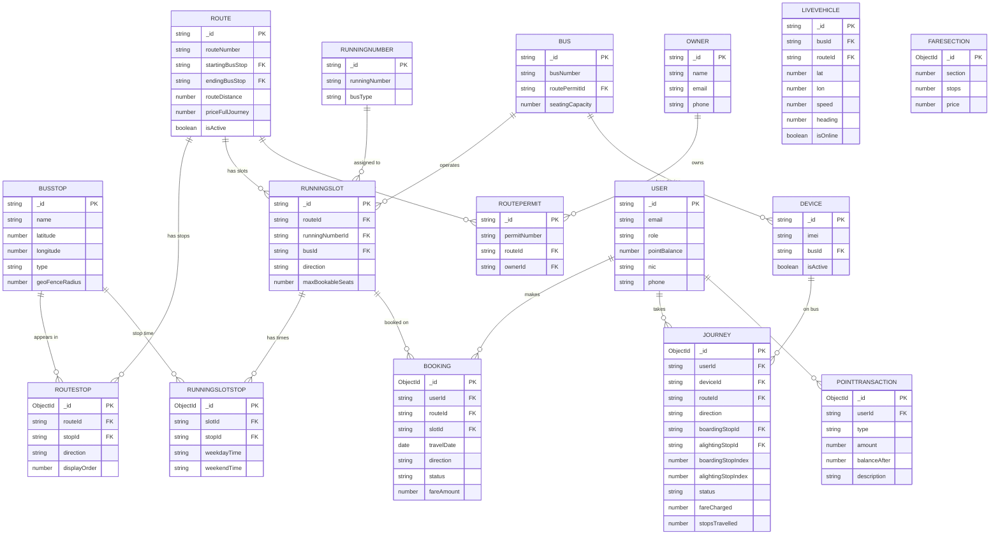

---

### Collection Reference

#### Route

| Field                   | Type    | Index | Description                       |
| ----------------------- | ------- | ----- | --------------------------------- |
| `_id`                   | String  | PK    | Route ID from SPGPS               |
| `routeNumber`           | String  | —     | Human-readable route name/number  |
| `startingBusStop`       | String  | —     | Starting stop ID                  |
| `endingBusStop`         | String  | —     | Ending stop ID                    |
| `routeDistance`         | Number? | —     | Total distance in km              |
| `priceFullJourney`      | Number  | —     | Full journey fare in points       |
| `averageCompletionTime` | Number  | —     | Estimated journey time in minutes |
| `isActive`              | Boolean | —     | Active status                     |
| `adminModified`         | Map     | —     | Admin-overridden field flags      |

#### BusStop

| Field            | Type   | Index | Description                                              |
| ---------------- | ------ | ----- | -------------------------------------------------------- |
| `_id`            | String | PK    | Stop ID from SPGPS                                       |
| `name`           | String | Text  | Human-readable stop name                                 |
| `latitude`       | Number | —     | WGS-84 latitude                                          |
| `longitude`      | Number | —     | WGS-84 longitude                                         |
| `type`           | String | —     | `bus_halt` \| `bus_station` \| `bus_stand` \| `geofence` |
| `geoFenceRadius` | Number | —     | Detection radius in metres                               |

#### RouteStop

| Field          | Type   | Index   | Description                    |
| -------------- | ------ | ------- | ------------------------------ |
| `routeId`      | String | Indexed | Route reference                |
| `stopId`       | String | Indexed | BusStop reference              |
| `direction`    | String | —       | `UP` \| `DOWN`                 |
| `displayOrder` | Number | —       | Sequence position in direction |

**Unique constraint:** `{ routeId, stopId, direction }`

#### RunningSlot

| Field              | Type    | Index   | Description                              |
| ------------------ | ------- | ------- | ---------------------------------------- |
| `_id`              | String  | PK      | Slot ID from SPGPS                       |
| `routeId`          | String  | Indexed | Route reference                          |
| `runningNumberId`  | String  | Indexed | RunningNumber reference                  |
| `busId`            | String? | Indexed | Assigned bus                             |
| `direction`        | String  | —       | `UP` \| `DOWN`                           |
| `maxBookableSeats` | Number  | —       | Maximum pre-bookable seats (default: 10) |

#### Journey

| Field                | Type    | Index     | Description                            |
| -------------------- | ------- | --------- | -------------------------------------- |
| `userId`             | String  | Composite | User reference                         |
| `deviceId`           | String  | Indexed   | GPS device (bus) reference             |
| `routeId`            | String  | —         | Route reference                        |
| `direction`          | String  | —         | `UP` \| `DOWN`                         |
| `boardingStopId`     | String  | —         | Stop ID where boarded                  |
| `boardingStopIndex`  | Number  | —         | Zero-based index in ordered stop list  |
| `alightingStopId`    | String? | —         | Stop ID where alighted                 |
| `alightingStopIndex` | Number? | —         | Zero-based index at alighting          |
| `stopsTravelled`     | Number? | —         | `                                      |
| `fareCharged`        | Number? | —         | Points deducted at alighting           |
| `status`             | String  | Composite | `active` \| `completed` \| `cancelled` |
| `startedAt`          | Date    | —         | Boarding timestamp                     |
| `endedAt`            | Date?   | —         | Alighting timestamp                    |

**Indices:** `{ userId, status }`, `{ userId, createdAt: -1 }`

#### FareSection

| Field     | Type            | Description                           |
| --------- | --------------- | ------------------------------------- |
| `section` | Number (unique) | Section order number                  |
| `stops`   | Number          | Maximum stops covered in this section |
| `price`   | Number          | Fare in points                        |

**Lookup logic:** `FareSection.findOne({ stops: { $gte: stopsTravelled } }).sort({ stops: 1 })`

---

## 7. Data Flow Analysis

### 7.1 Live Bus Tracking Flow (Every 15 Seconds)

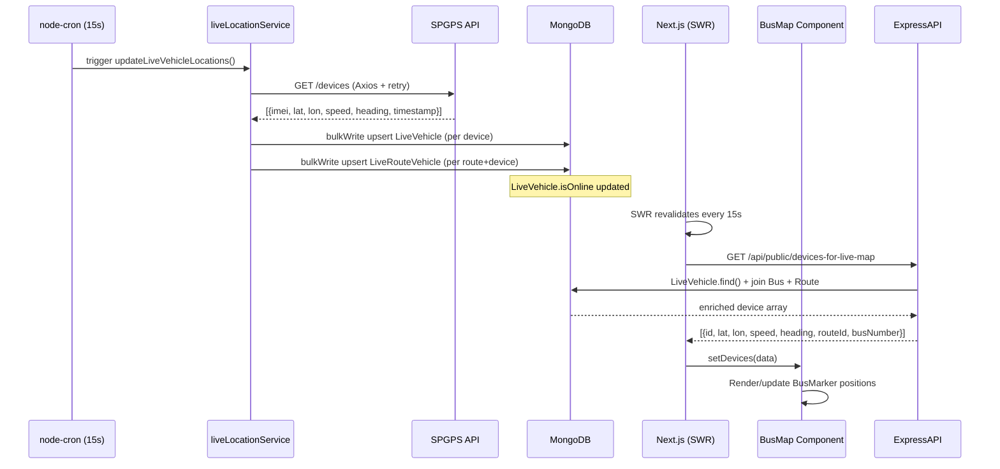

### 7.2 Static Data Sync Flow (Every 1 Hour)

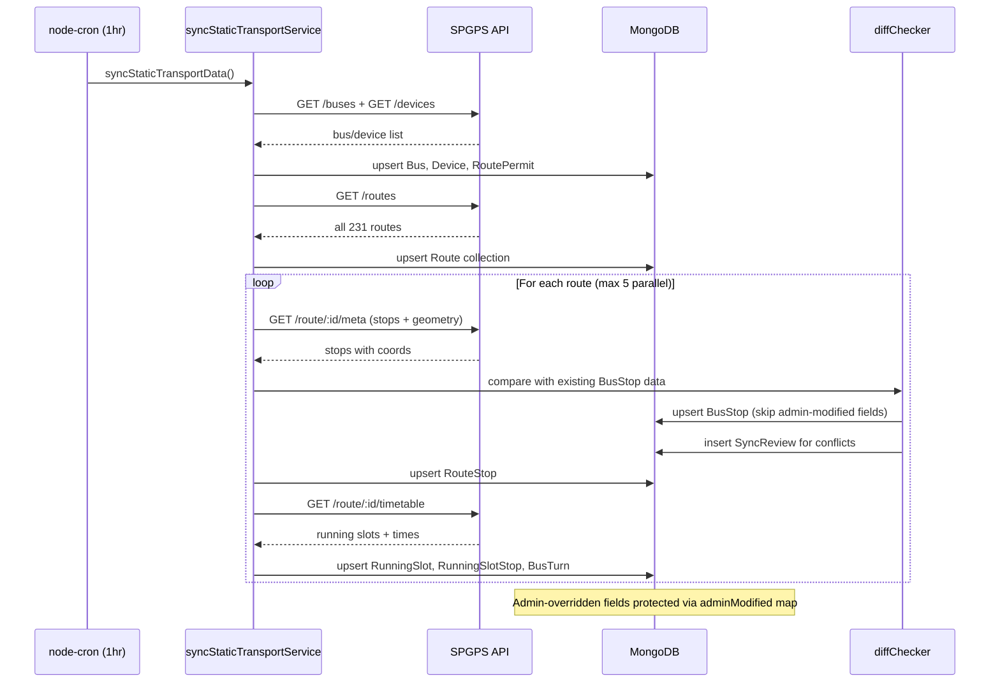

### 7.3 Booking & Payment Flow

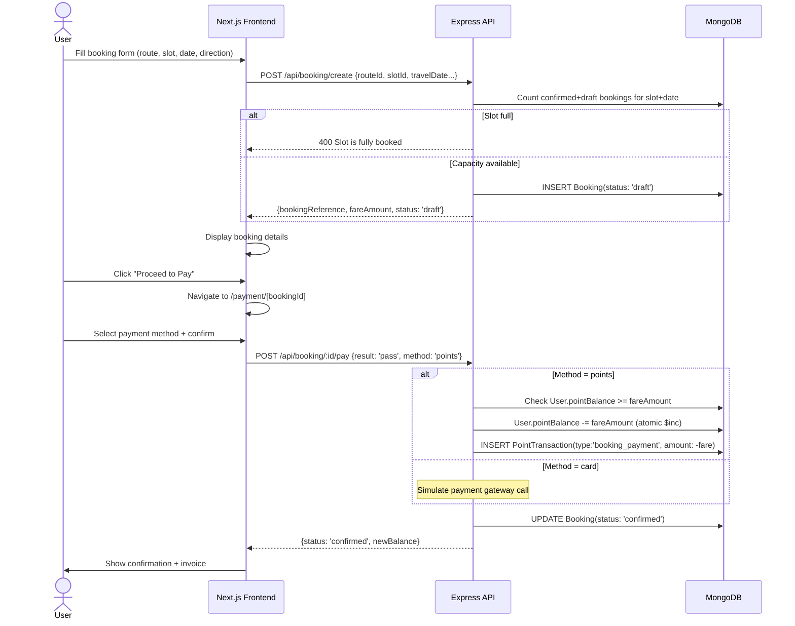

### 7.4 Journey (Ride) Tracking Flow

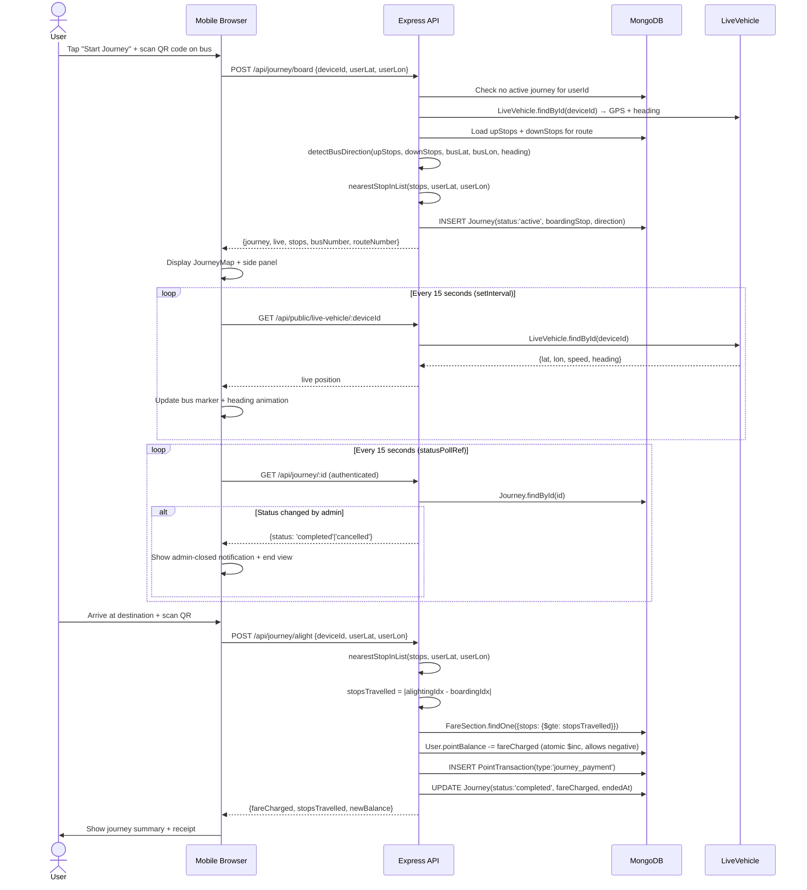

---

## 8. Frontend Architecture

### UI Framework & Routing

The frontend is a **Next.js 16 App Router** application. Pages are defined as `page.tsx` files within the `app/` directory. The App Router enables server components and nested layouts, though most pages are client components (`"use client"`) due to interactive state requirements.

**Routing pattern:** All routes are client-side navigated. Admin pages share a persistent sidebar layout via `app/admin/layout.tsx`.

### State Management

LK Bus Radar does **not** use a global state manager (no Redux, Zustand, or Context API for business data). State is managed at two levels:

1. **Server cache (SWR)** — Routes and live device data are fetched and cached by SWR in `useTransportData`. SWR handles deduplication, background refresh, and loading states.
2. **Local component state (`useState`)** — All page-level state (selected route, panel open/closed, form values, pagination) is managed locally with React hooks.

### Component Hierarchy

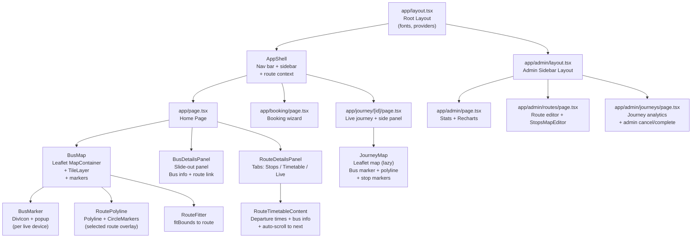

### Data Fetching Patterns

| Pattern                  | Hook / Method                                    | Use Case                                        |
| ------------------------ | ------------------------------------------------ | ----------------------------------------------- |
| **SWR polling**          | `useSWR(url, fetcher, { refreshInterval })`      | Public data: routes, live devices, timetable    |
| **Auth-protected fetch** | `safeFetch(url, { headers: { Authorization } })` | User data: journeys, bookings, wallet           |
| **setInterval polling**  | `pollRef.current = setInterval(...)`             | Live journey position (30s), status check (15s) |
| **Manual trigger**       | `async function load()` called in `useEffect`    | Initial data load on page mount                 |

---

## 9. Component Documentation

### Map Components

| Component       | File                                     | Responsibility                                                                                                    | Key Props                                                                                         |
| --------------- | ---------------------------------------- | ----------------------------------------------------------------------------------------------------------------- | ------------------------------------------------------------------------------------------------- |
| `BusMap`        | `components/map/BusMap.tsx`              | Primary Leaflet map. Renders all live bus markers, handles route overlay, manages camera                          | `devices`, `routes`, `routeOverlay`, `routeDirection`, `focusPoint`, `onBusClick`, `onRouteClick` |
| `BusMarker`     | `components/map/BusMarker.tsx`           | Individual animated bus marker on map. Custom divIcon with heading rotation                                       | `device`, `isSelected`, `onClick`                                                                 |
| `RoutePolyline` | `components/map/RoutePolyline.tsx`       | Draws route path as Leaflet Polyline + CircleMarker stops                                                         | `stops`, `color`, `weight`                                                                        |
| `RouteFitter`   | `components/map/RouteFitter.tsx`         | Auto-fits map viewport bounds to contain all stops in the route                                                   | `stops`                                                                                           |
| `JourneyMap`    | `app/journey/[journeyId]/JourneyMap.tsx` | Journey-specific map: live bus position + colored route segments + stop markers. Loaded lazily via `next/dynamic` | `stops`, `live`, `boardingStopIndex`, `currentBusStopIndex`, `isCompleted`                        |

### Panel Components

| Component               | File                                          | Responsibility                                                                                | Key Props                                                                 |
| ----------------------- | --------------------------------------------- | --------------------------------------------------------------------------------------------- | ------------------------------------------------------------------------- |
| `BusDetailsPanel`       | `components/panels/BusDetailsPanel.tsx`       | Slide-out panel showing selected bus details, route, live speed                               | `device`, `route`, `onClose`, `onRouteClick`                              |
| `RouteDetailsPanel`     | `components/panels/RouteDetailsPanel.tsx`     | Three-tab panel: (1) Stops list with direction toggle, (2) Timetable, (3) Live buses on route | `route`, `meta`, `devices`, `onClose`, `onBusSelect`, `onDirectionChange` |
| `RouteTimetableContent` | `components/panels/RouteTimetableContent.tsx` | Timetable viewer. Shows bus type, plate number if live, auto-scrolls to nearest upcoming slot | `routeId`, `direction`                                                    |
| `TimetableInnerPanel`   | `components/panels/TimetableInnerPanel.tsx`   | Inner content for timetable rendering                                                         | `entries`, `routeId`                                                      |

### Layout Components

| Component   | File                             | Responsibility                                                                            |
| ----------- | -------------------------------- | ----------------------------------------------------------------------------------------- |
| `AppShell`  | `components/layout/AppShell.tsx` | Global layout wrapper: top navigation bar, mobile bottom nav, authentication state header |
| `AuthModal` | `components/ui/AuthModal.tsx`    | Firebase sign-in/sign-up modal dialog. Uses email/password auth                           |
| `SearchBar` | `components/ui/SearchBar.tsx`    | Global route search with typeahead — queries `/api/public/routes?searchKey=...`           |

---

## 10. Service Dependency Graph

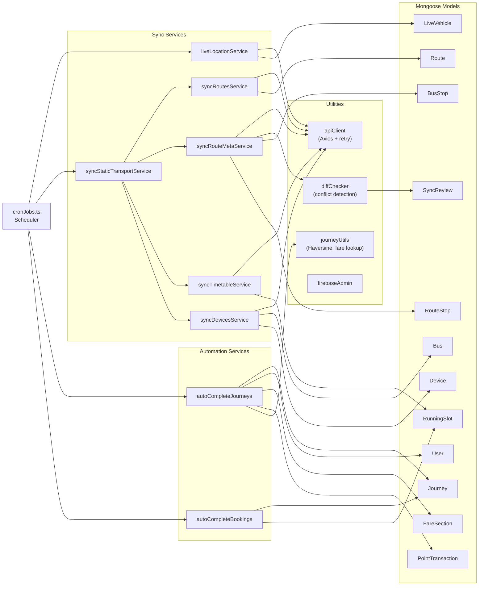

---

## 11. API Dependency Graph

```mermaid
graph LR
    subgraph PublicAPI["Public API (No Auth)"]
        GET_routes["GET /routes"]
        GET_withMeta["GET /withMeta/:id"]
        GET_devices["GET /devices-for-live-map"]
        GET_timetable["GET /timetable/:routeId"]
        GET_liveVehicle["GET /live-vehicle/:deviceId"]
        GET_busPassengers["GET /bus-passengers/:deviceId"]
    end

    subgraph UserAPI["User API (requireAuth)"]
        GET_profile["GET /user/profile"]
        PUT_profile["PUT /user/profile"]
        GET_points["GET /user/points"]
        POST_topup["POST /user/points/topup"]
    end

    subgraph BookingAPI["Booking API (requireAuth)"]
        POST_booking["POST /booking/create"]
        POST_pay["POST /booking/:id/pay"]
        GET_mybookings["GET /booking/my"]
    end

    subgraph JourneyAPI["Journey API (requireAuth)"]
        POST_board["POST /journey/board"]
        POST_alight["POST /journey/alight"]
        GET_active["GET /journey/active"]
        GET_history["GET /journey/history"]
    end

    subgraph AdminAPI["Admin API (requireAdmin)"]
        GET_stats["GET /admin/fleet/stats"]
        CRUD_routes["CRUD /admin/fleet/routes"]
        CRUD_buses["CRUD /admin/fleet/buses"]
        PATCH_complete["PATCH /admin/fleet/journeys/:id/complete"]
        PATCH_cancel["PATCH /admin/fleet/journeys/:id/cancel"]
    end

    subgraph Services["Backend Services & Models"]
        RouteModel["Route Model"]
        BusStopModel["BusStop + RouteStop Model"]
        LiveVehicleModel["LiveVehicle Model"]
        UserModel["User Model"]
        BookingModel["Booking Model"]
        JourneyModel["Journey Model"]
        FareSectionModel["FareSection Model"]
        JourneyUtilsSvc["journeyUtils"]
        PointTxModel["PointTransaction Model"]
    end

    GET_routes --> RouteModel
    GET_withMeta --> RouteModel
    GET_withMeta --> BusStopModel
    GET_devices --> LiveVehicleModel
    GET_timetable --> RouteModel
    GET_liveVehicle --> LiveVehicleModel
    GET_busPassengers --> JourneyModel
    GET_busPassengers --> BookingModel

    GET_profile --> UserModel
    PUT_profile --> UserModel
    GET_points --> UserModel
    GET_points --> PointTxModel
    POST_topup --> UserModel
    POST_topup --> PointTxModel

    POST_booking --> BookingModel
    POST_booking --> RouteModel
    POST_pay --> BookingModel
    POST_pay --> UserModel
    POST_pay --> PointTxModel

    POST_board --> LiveVehicleModel
    POST_board --> BusStopModel
    POST_board --> JourneyModel
    POST_board --> JourneyUtilsSvc
    POST_alight --> JourneyModel
    POST_alight --> FareSectionModel
    POST_alight --> UserModel
    POST_alight --> PointTxModel
    POST_alight --> JourneyUtilsSvc

    PATCH_complete --> JourneyModel
    PATCH_complete --> FareSectionModel
    PATCH_complete --> UserModel
    PATCH_complete --> PointTxModel
    PATCH_complete --> JourneyUtilsSvc
    PATCH_cancel --> JourneyModel

    GET_stats --> RouteModel
    GET_stats --> BookingModel
    GET_stats --> JourneyModel
    GET_stats --> LiveVehicleModel
```

---

## 12. Event & Communication Architecture

### Communication Patterns

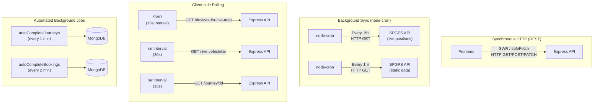

### Communication Patterns Summary

| Pattern                    | Mechanism     | Direction       | Frequency  | Purpose                              |
| -------------------------- | ------------- | --------------- | ---------- | ------------------------------------ |
| **REST API calls**         | HTTP JSON     | Client → Server | On demand  | All user interactions, CRUD          |
| **SWR polling**            | HTTP GET      | Client → Server | 15 seconds | Live bus positions for map           |
| **Journey live poll**      | `setInterval` | Client → Server | 30 seconds | Active journey bus position update   |
| **Journey status poll**    | `setInterval` | Client → Server | 15 seconds | Detect admin-initiated journey close |
| **GPS sync (cron)**        | HTTP GET      | Server → SPGPS  | 15 seconds | Ingest live vehicle positions        |
| **Static sync (cron)**     | HTTP GET      | Server → SPGPS  | 1 hour     | Ingest routes, stops, timetables     |
| **Auto-complete journeys** | cron + DB     | Server internal | 1 minute   | Close journeys at last stop          |
| **Auto-complete bookings** | cron + DB     | Server internal | 2 minutes  | Expire past-date bookings            |

### Event: Admin-Initiated Journey Close

When an administrator manually completes or cancels a journey, there is no WebSocket push to the client. Instead, the user's journey page polls `GET /api/journey/:id` every 15 seconds. On detecting a non-`active` status, the page immediately:

1. Stops both `pollRef` (live position) and `statusPollRef` (status check) intervals
2. Sets `adminClosed` state to `"completed"` or `"cancelled"`
3. Updates the `journey` state from the server response
4. Triggers a re-render showing either the completed journey summary or the cancelled journey view

This polling approach avoids WebSocket complexity at the cost of up to a 15-second delay in notification.

---

## 13. Security Architecture

### Authentication

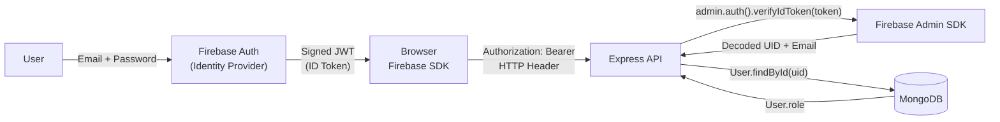

### Authorization Layers

| Layer                | Mechanism                 | Enforcement                                                                        |
| -------------------- | ------------------------- | ---------------------------------------------------------------------------------- |
| **Public API**       | No authentication         | No middleware — intentionally open                                                 |
| **User endpoints**   | Firebase JWT verification | `requireAuth` middleware on all `/api/booking`, `/api/journey`, `/api/user` routes |
| **Admin endpoints**  | JWT + DB role check       | `requireAdmin` middleware — verifies `User.role === 'admin'` in MongoDB            |
| **Admin role grant** | DB update only            | `PATCH /admin/fleet/users/:id/role` — can only be called by existing admins        |

### Token Verification Flow

```typescript
// authMiddleware.ts (simplified)
async function requireAuth(req, res, next) {
  const token = req.headers.authorization?.split(' ')[1];
  if (!token) return res.status(401).json({ error: 'Unauthorized' });

  const decoded = await admin.auth().verifyIdToken(token); // Firebase validates signature + expiry
  await syncUserFromToken(decoded);  // Upsert user in DB
  req.user = { uid: decoded.uid, email: decoded.email };
  next();
}

async function requireAdmin(req, res, next) {
  await requireAuth(req, res, async () => {
    const user = await User.findById(req.user.uid);
    if (user?.role !== 'admin') return res.status(403).json({ error: 'Forbidden' });
    next();
  });
}
```

### Input Validation

| Validation Type   | Location               | Implementation                                    |
| ----------------- | ---------------------- | ------------------------------------------------- |
| NIC format        | `userController.ts`    | Regex: `/^[0-9]{9}[VXvx]$\|^[0-9]{12}$/`          |
| Phone format      | `userController.ts`    | Regex: `/^(?:\+94\|94\|0)?[0-9]{9,10}$/`          |
| Booking amount    | `bookingController.ts` | `fareAmount > 0`, slot capacity check             |
| Top-up limits     | `userController.ts`    | `1 ≤ amount ≤ 10,000`, integer check              |
| Schema validation | Mongoose               | `required`, `enum`, `min/max` on all model fields |

### Data Protection

- **Points balance integrity** — Wallet debits use atomic MongoDB `$inc` operations to prevent race conditions with concurrent journey/booking payments
- **Admin field protection** — The `adminModified` map prevents SPGPS sync from overwriting admin-edited fields
- **Firebase private key** — Stored as a base64-encoded string in `server/.env`, decoded at runtime. Never committed to source control.
- **CORS** — Configured to allow only specific origins in production

---

## 14. Performance Considerations

### Database Indexing Strategy

| Collection         | Index                                              | Query Pattern                 |
| ------------------ | -------------------------------------------------- | ----------------------------- |
| `Route`            | `{ routeNumber: text }`                            | Route search by name          |
| `RouteStop`        | `{ routeId: 1 }`                                   | Load all stops for a route    |
| `RouteStop`        | `{ routeId: 1, stopId: 1, direction: 1 }` (unique) | Upsert during sync            |
| `RunningSlot`      | `{ routeId: 1 }`                                   | Load timetable for route      |
| `LiveVehicle`      | `{ routeId: 1, timestamp: -1 }`                    | Filter by route, latest first |
| `LiveRouteVehicle` | `{ routeId: 1, deviceId: 1 }` (unique)             | Upsert during live sync       |
| `Journey`          | `{ userId: 1, status: 1 }`                         | Find active journey for user  |
| `Journey`          | `{ userId: 1, createdAt: -1 }`                     | Journey history, newest first |
| `Booking`          | `{ userId: 1, travelDate: -1 }`                    | User booking history          |
| `PointTransaction` | `{ userId: 1, createdAt: -1 }`                     | Transaction history           |
| `BusStandContact`  | `{ district: 1 }`                                  | Filter by district            |
| `BusStandContact`  | `{ location: text }`                               | Text search by name           |

### Caching via SWR

The frontend uses SWR's built-in memory cache keyed by URL. Key configurations:

- **Routes** — `refreshInterval: 0` (static, no polling). Cached until page unmount.
- **Live devices** — `refreshInterval: 15000` (15 seconds). Matches backend sync interval.
- **Timetable** — Fetched once per route panel open, no re-poll.
- **Bus passengers** — Per-device poll embedded in journey active fetch.

### SPGPS API Client Retry Strategy

```typescript
// apiClient.ts
async function getWithRetry(url, options = {}, retries = API_RETRY_COUNT) {
  for (let attempt = 0; attempt < retries; attempt++) {
    try {
      return await axios.get(url, { timeout: API_TIMEOUT_MS, ...options });
    } catch (err) {
      if (attempt === retries - 1) throw err;
      await sleep(API_RETRY_DELAY_MS * (attempt + 1)); // Exponential-style backoff
    }
  }
}
```

Environment variables: `API_TIMEOUT_MS`, `API_RETRY_COUNT`, `API_RETRY_DELAY_MS`.

### Concurrent Sync Throttling

The static sync processes up to **5 routes in parallel** using `p-limit` or a custom concurrency controller. This prevents overwhelming the SPGPS API while keeping total sync time manageable for 231 routes.

### Route Path Calculation

For the journey map, OSRM (Open Source Routing Machine) is called client-side with up to **20 sampled stops** from the full stop list. This uses the public `router.project-osrm.org` endpoint and falls back to straight-line polylines if the OSRM call fails or times out.

---

## 15. Deployment Architecture

### Current Architecture (Development / Single-Server)

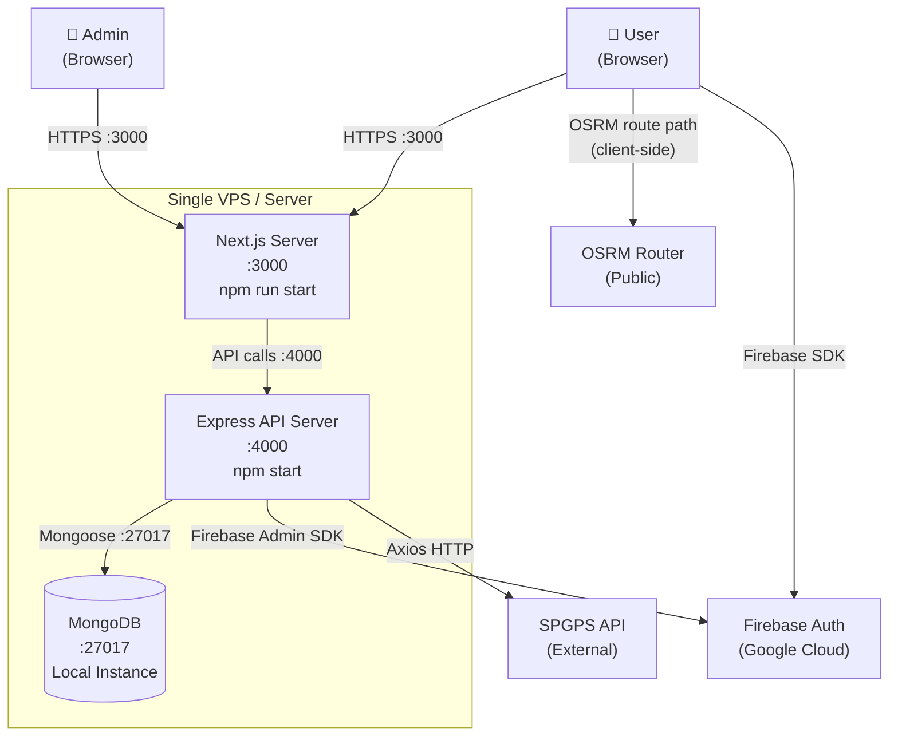

### Environment Variables

#### Frontend (`project/.env`)

| Variable                                   | Description                                         |
| ------------------------------------------ | --------------------------------------------------- |
| `NEXT_PUBLIC_API_URL`                      | Backend base URL (default: `http://localhost:4000`) |
| `NEXT_PUBLIC_FIREBASE_API_KEY`             | Firebase web API key                                |
| `NEXT_PUBLIC_FIREBASE_AUTH_DOMAIN`         | Firebase auth domain                                |
| `NEXT_PUBLIC_FIREBASE_PROJECT_ID`          | Firebase project ID                                 |
| `NEXT_PUBLIC_FIREBASE_STORAGE_BUCKET`      | Firebase storage bucket                             |
| `NEXT_PUBLIC_FIREBASE_MESSAGING_SENDER_ID` | Firebase messaging sender                           |
| `NEXT_PUBLIC_FIREBASE_APP_ID`              | Firebase app ID                                     |

#### Backend (`project/server/.env`)

| Variable                | Description                     |
| ----------------------- | ------------------------------- |
| `MONGO_URI`             | MongoDB connection string       |
| `PORT`                  | API server port (default: 4000) |
| `NODE_ENV`              | `development` \| `production`   |
| `FIREBASE_PROJECT_ID`   | Firebase project ID (Admin SDK) |
| `FIREBASE_CLIENT_EMAIL` | Firebase service account email  |
| `FIREBASE_PRIVATE_KEY`  | Base64-encoded private key      |
| `API_TIMEOUT_MS`        | SPGPS API request timeout in ms |
| `API_RETRY_COUNT`       | SPGPS API retry attempts        |
| `API_RETRY_DELAY_MS`    | SPGPS API retry delay in ms     |

### Startup Sequence

```bash
# Terminal 1 — Backend
cd project/server
npm run dev          # ts-node with nodemon, hot reload on :4000

# Terminal 2 — Frontend
cd project
npm run dev          # Next.js dev server on :3000
```

On backend startup:

1. `config/db.ts` — `mongoose.connect(MONGO_URI)` establishes DB connection
2. `utils/firebaseAdmin.ts` — Firebase Admin SDK initialised with service account
3. Express routes mounted
4. `cronJobs.ts` — All cron jobs registered and started

---

## 16. Observability

### Logging

The backend uses a `logger.ts` utility for structured console logging. Log entries include:

- **Sync job results** — `[SYNC] Routes: +12 inserted, ~3 updated, 0 errors`
- **Cron job lifecycle** — Job start/end timestamps, mutex lock acquisition
- **API errors** — Failed SPGPS calls with status codes and retry attempts
- **Auth events** — Token verification failures (without exposing token content)
- **Journey events** — Board/alight events with userId and deviceId

### Health Check Endpoint

```
GET /health
```

Returns `{ status: 'ok', timestamp: '...' }`. Used by load balancers and monitoring tools to verify server liveness.

### Admin Dashboard Metrics

The `/admin` dashboard provides real-time operational visibility:

- **Fleet stats** — Total buses, routes, slots, online devices, admin count
- **Today's activity** — Journeys started today, active now, revenue today
- **All-time totals** — Total revenue (points), total journeys completed
- **Booking status distribution** — Draft / Confirmed / Cancelled / Completed (Pie chart)
- **Journey status distribution** — Active / Completed / Cancelled (Pie chart)
- **Sync conflict count** — Pending conflicts awaiting review

### Sync Review System

The `SyncReview` collection provides an audit trail of all data conflicts detected during SPGPS sync. Admins can:

- View fields where SPGPS value differs from admin-modified value
- Approve (accept SPGPS value) or Ignore (keep current value) per field
- Batch approve/ignore multiple conflicts

---

## 17. Scalability Strategy

### Current Constraints

The system currently runs as a single-process Node.js application on a single server with a local MongoDB instance. This works well for the current scale (231 routes, ~100-200 concurrent users) but will require architectural changes to scale beyond that.

### Horizontal Scaling Path

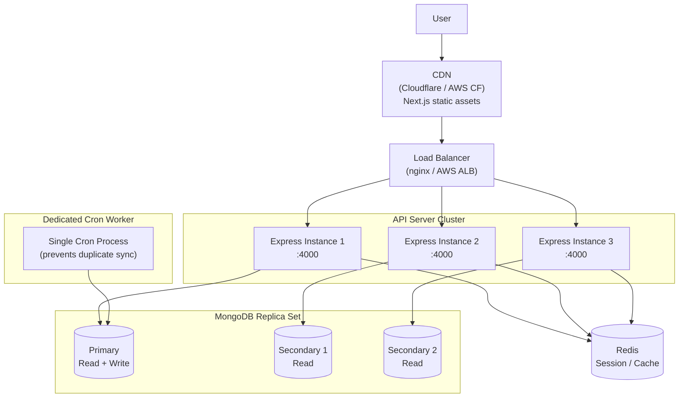

### Scaling Recommendations

| Component          | Strategy                                                        | Rationale                                                         |
| ------------------ | --------------------------------------------------------------- | ----------------------------------------------------------------- |
| **Express API**    | Horizontal — multiple PM2 cluster workers or container replicas | Stateless; all state in MongoDB/Firebase                          |
| **Cron jobs**      | Isolate to a single dedicated worker process                    | Prevent duplicate sync runs across replicas                       |
| **MongoDB**        | Replica set (1 primary + 2 secondaries)                         | Read scaling + automatic failover                                 |
| **Next.js**        | Deploy as static export + edge functions on Vercel/Cloudflare   | CDN distribution of static assets                                 |
| **Live GPS cache** | Redis cache for `LiveVehicle` data                              | Reduce MongoDB load from 15s polling                              |
| **SWR refresh**    | Increase to 30s if GPS update rate decreases                    | Match refresh interval to actual data change rate                 |
| **Sync jobs**      | Queue-based (BullMQ/Redis) for route sync                       | Retry failed individual route syncs without re-processing all 231 |

### Database Sharding Strategy (Future)

For very large deployments, MongoDB collections can be sharded by geographic region or route cluster, with `routeId` as the natural shard key for `RouteStop`, `RunningSlot`, and `LiveRouteVehicle` collections.

---

## 18. Future Improvements

### Performance Improvements

| Improvement                          | Impact                                                          | Effort       |
| ------------------------------------ | --------------------------------------------------------------- | ------------ |
| **WebSocket / SSE for live updates** | Eliminate polling; push GPS updates to clients in real time     | Medium       |
| **Redis cache layer**                | Cache `LiveVehicle`, route metadata; reduce DB load by 70%+     | Medium       |
| **MongoDB Read Replicas**            | Offload read-heavy queries (routes, stops) to secondaries       | Low (config) |
| **OSRM self-hosted**                 | Replace public OSRM with self-hosted instance for reliability   | Medium       |
| **Stop search full-text index**      | Improve bus stop typeahead latency with proper text index       | Low          |
| **Pagination cursor-based**          | Replace skip/limit with cursor pagination for large collections | Medium       |

### Security Improvements

| Improvement            | Priority | Description                                                                                                |
| ---------------------- | -------- | ---------------------------------------------------------------------------------------------------------- |
| **Rate limiting**      | High     | Add `express-rate-limit` on auth endpoints and public APIs to prevent abuse                                |
| **Sync endpoint auth** | High     | `/admin/sync-static` and `/admin/update-live` should require `requireAdmin`                                |
| **HTTPS enforcement**  | High     | Enforce TLS in production; HSTS headers                                                                    |
| **Input sanitisation** | Medium   | Add `express-validator` for all body parameters                                                            |
| **Audit log**          | Medium   | Log all admin mutations (create/update/delete) with `userId` and timestamp                                 |
| **CSP headers**        | Medium   | Add Content Security Policy headers via Next.js middleware                                                 |
| **Secrets management** | Medium   | Migrate Firebase credentials from `.env` file to a secrets manager (AWS Secrets Manager / HashiCorp Vault) |

### Reliability Improvements

| Improvement                             | Description                                                                                  |
| --------------------------------------- | -------------------------------------------------------------------------------------------- |
| **Dead letter queue for sync failures** | Failed individual route syncs should be retried independently, not block the entire sync job |
| **Circuit breaker for SPGPS API**       | If SPGPS API fails repeatedly, stop retrying and serve stale data gracefully                 |
| **Journey auto-complete reliability**   | Add idempotency key to auto-complete to prevent double-charging on cron overlap              |
| **Booking expiry events**               | Replace polling-based booking expiry with TTL index on `Booking.expiresAt`                   |
| **DB connection pooling**               | Configure Mongoose `poolSize` for production connection pool tuning                          |

### Feature Enhancements

| Feature                    | Description                                                                        |
| -------------------------- | ---------------------------------------------------------------------------------- |
| **Real payment gateway**   | Integrate PayHere or Stripe for actual LKR top-up transactions                     |
| **Push notifications**     | Notify users when bus is approaching their boarding stop                           |
| **Offline map caching**    | Cache tile layer offline for areas with poor connectivity                          |
| **Bus ETA calculation**    | Compute estimated time of arrival at each upcoming stop from live position + speed |
| **Passenger feedback**     | Allow users to rate journeys and report incidents                                  |
| **Multi-language support** | Sinhala and Tamil localisation for the public-facing UI                            |
| **Driver mobile app**      | Dedicated PWA for drivers to confirm trip start/end independently of GPS           |

---

*Documentation generated from source analysis of LK Bus Radar v1.0 — March 2026*
*Project repository: `F:\LK_BUS_RADAR\project`*
